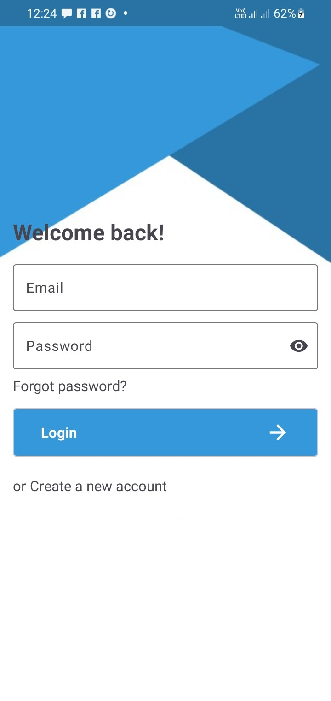
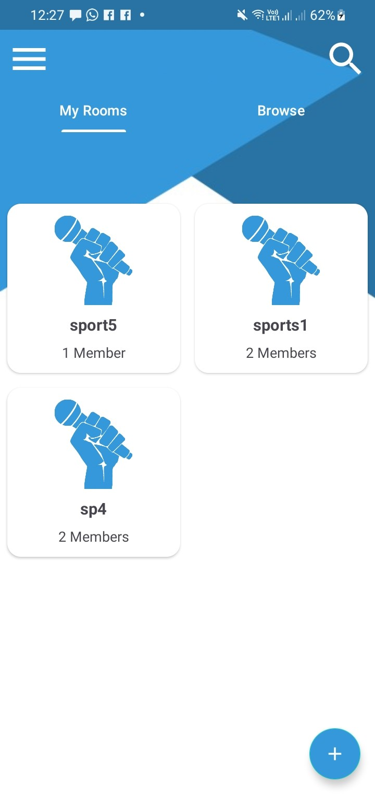
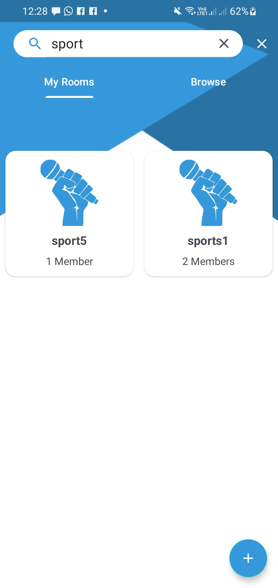
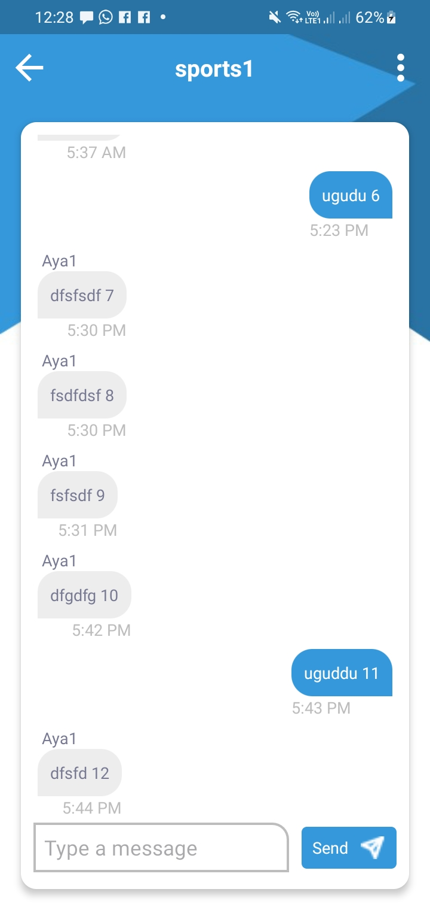
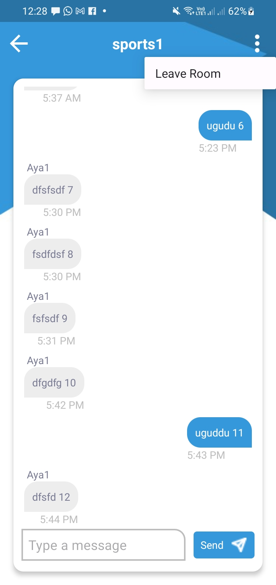

# Chat App for Android

## Overview

This Android chat application showcases my skills and expertise in building modern Android apps
using technologies such as Firebase, MVVM architecture, Fragments, and Navigation Component. The app
provides a user-friendly interface for real-time messaging, demonstrating seamless communication and
data management.

### Features

- **Real-time Messaging**: Utilizes Firebase Realtime Database for instant message synchronization.
- **User Authentication**: Firebase Authentication ensures secure and personalized user access.
- **MVVM Architecture**: Implements a clean and modular structure for better maintainability and
  testability.
- **Fragments**: Utilizes Android Fragments for modular UI components.
- **Navigation Component**: Implements the Navigation Component for a smooth and intuitive user
  experience.

## Screenshots

<p align="center">
  
  
  
</p>
<p align="center">
  
  
</p>

## Technologies Used

- **Firebase**: Realtime Database, Authentication.
- **MVVM Architecture**: Separation of concerns for improved scalability.
- **Fragments**: Modular UI components for flexible design.
- **Navigation Component**: Streamlined navigation flow.

## Getting Started

1. Clone the repository:

```bash
git clone https://github.com/Mahmoud-Ibrahim-750/ChatApp.git
```

2. Open the project in Android Studio.

3. Connect the app to your Firebase project.

4. Run the app on an emulator or physical device.

## Contributing

Feel free to contribute to the project by opening issues or submitting pull requests. Your feedback
and enhancements are welcome.

## License

This project is licensed under the [MIT License](LICENSE).

## Contact

For any inquiries or collaboration opportunities, feel free to reach me out at
futuredream31@gmail.com.
